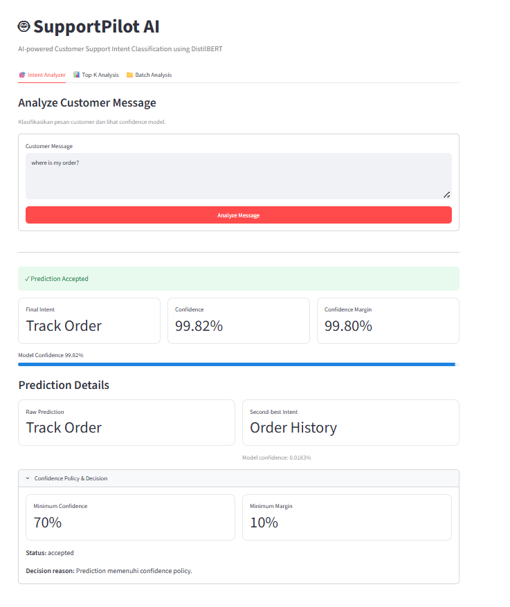
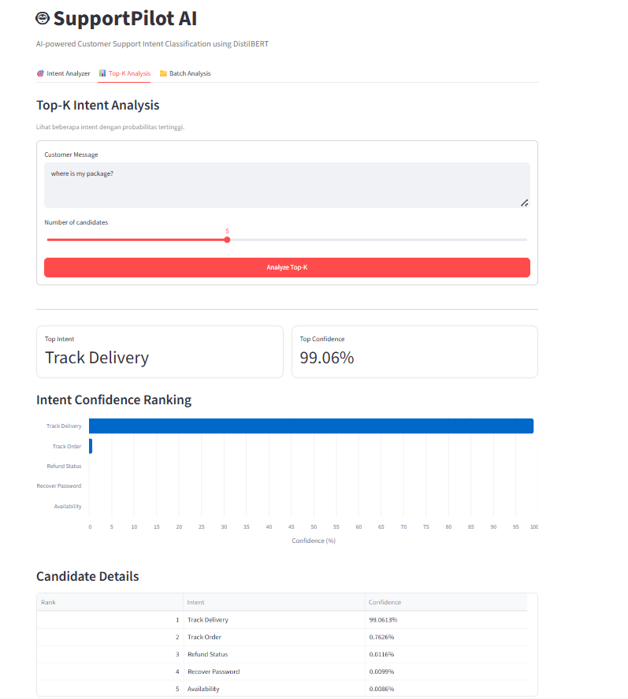
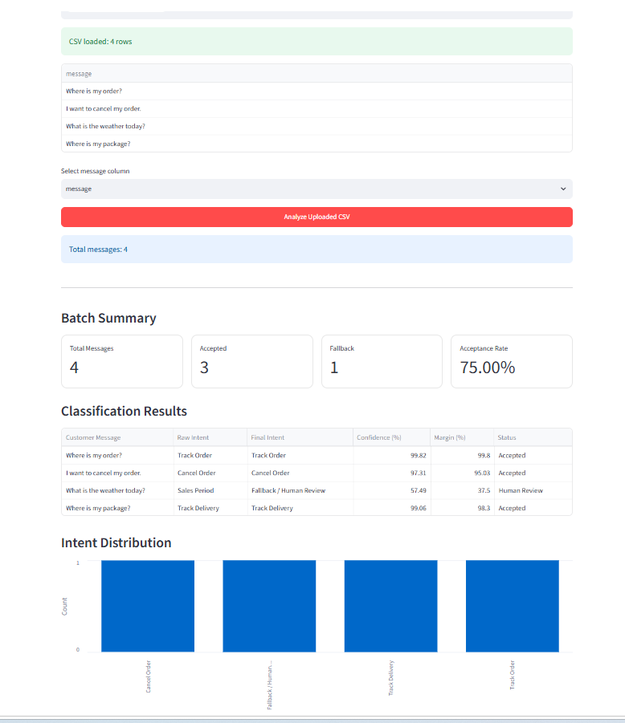

# SupportPilot AI

SupportPilot AI adalah sistem **Customer Support Intent Classification**
berbasis Machine Learning dan Natural Language Processing (NLP).

Sistem menerima pesan customer, mengidentifikasi intent dari pesan tersebut,
kemudian menghasilkan prediksi intent beserta confidence score.

Model utama menggunakan **DistilBERT** dan disediakan melalui REST API
menggunakan **FastAPI**.

---

## Project Overview

Customer support menerima berbagai jenis pesan seperti:

- pelacakan pesanan
- pembatalan pesanan
- pembayaran
- refund
- retur produk
- delivery
- account management
- product information
- dan kebutuhan customer lainnya

SupportPilot AI mengotomatisasi proses klasifikasi pesan tersebut menjadi
salah satu dari **46 intent**.

Contoh:

```text
Input:
"Where is my order?"

Output:
Intent     : track_order
Confidence : 99.82%
Status     : accepted
```

Sistem juga memiliki **confidence policy dan fallback mechanism** untuk
mengurangi risiko penggunaan prediksi ketika model memiliki confidence
yang rendah.

---

# Machine Learning Pipeline

Pipeline pengembangan model:

```text
Raw Dataset
    ↓
Data Understanding
    ↓
Data Preprocessing
    ↓
Train / Validation / Test Split
    ↓
Logistic Regression
    ↓
Linear SVM
    ↓
DistilBERT Fine-Tuning
    ↓
Validation Model Comparison
    ↓
Final Model Selection
    ↓
Final Test Evaluation
    ↓
Error Analysis
    ↓
Production Inference
```

---

# Models

Tiga model dikembangkan dan dibandingkan.

| Model | Validation Accuracy | Validation Macro F1 |
|---|---:|---:|
| Logistic Regression | 98.2378% | 98.2562% |
| Linear SVM | 98.7285% | 98.7429% |
| DistilBERT | **99.6431%** | **99.6491%** |

Model dipilih berdasarkan **Macro F1 pada Validation Set**.

### Final Model

```text
Model      : DistilBERT
Classes    : 46
Max Length : 64 tokens
```

DistilBERT menjadi model final karena memiliki performa validation terbaik.

---

# Final Test Result

Final Test Set hanya digunakan setelah proses model selection selesai.

| Metric | Score |
|---|---:|
| Accuracy | **99.7323%** |
| Macro Precision | **99.7436%** |
| Macro Recall | **99.7287%** |
| Macro F1 | **99.7325%** |
| Weighted F1 | **99.7326%** |

```text
Test Samples       : 4,483
Correct Prediction : 4,471
Prediction Errors  : 12
```

Model berhasil mengklasifikasikan sekitar **99.73%** data Final Test
dengan benar.

---

# Error Analysis

Dari 4,483 Final Test samples hanya terdapat 12 prediction errors.

Beberapa confusion pair utama:

```text
return_policy
    → return_product_online

damaged_delivery
    → wrong_item

track_order
    → track_delivery
```

Sebagian error terjadi pada intent yang memiliki kedekatan makna.

Confidence analysis terhadap prediction errors menunjukkan:

```text
Error confidence >= 90%      : 75.00%
Error confidence >= 95%      : 50.00%
Actual intent = second-best   : 91.67%
Confidence margin < 0.10      : 8.33%
```

Hasil tersebut menunjukkan bahwa confidence score saja tidak selalu
menjamin prediction benar.

---

# Production Inference

Production inference tersedia pada:

```text
src/inference/distilbert_inference.py
```

Fitur utama:

```text
predict_intent()
predict_top_k()
analyze_prediction_confidence()
predict_with_fallback()
predict_batch()
get_model_info()
```

---

# Confidence Policy

Default production policy:

```text
Minimum Confidence : 70%
Minimum Margin     : 10%
```

Prediction diterima apabila:

```text
confidence >= 0.70
AND
confidence_margin >= 0.10
```

Jika tidak memenuhi policy:

```text
final_intent = fallback
```

---

# Streamlit User Interface

SupportPilot AI menyediakan web interface berbasis **Streamlit**
untuk berinteraksi dengan production model melalui FastAPI.

UI berjalan sebagai service terpisah dan berkomunikasi dengan
FastAPI melalui internal Docker network.

## Features

### Intent Analyzer

Melakukan klasifikasi terhadap satu customer message.

Fitur yang ditampilkan:

- Final intent
- Raw model prediction
- Confidence score
- Confidence margin
- Second-best intent
- Confidence policy decision
- Automatic fallback / human review



---

### Top-K Intent Analysis

Menampilkan beberapa intent dengan probability tertinggi dari model.

Fitur:

- Top intent
- Top confidence
- Top-K candidate ranking
- Confidence visualization
- Candidate detail table



---

### Batch Analysis

Mendukung klasifikasi banyak customer message sekaligus.

Input dapat diberikan melalui:

- Multi-line text
- CSV upload

Output mencakup:

- Total messages
- Accepted predictions
- Fallback predictions
- Acceptance rate
- Classification result table
- Intent distribution
- Downloadable CSV result



---

# System Architecture

```text
                           SupportPilot AI
                                  │
                                  ▼
                        ┌───────────────────┐
                        │   Streamlit UI    │
                        │      :8501        │
                        └─────────┬─────────┘
                                  │
                                  │ Internal Docker Network
                                  ▼
                        ┌───────────────────┐
                        │     FastAPI       │
                        │      :8000        │
                        └─────────┬─────────┘
                                  │
                                  ▼
                        ┌───────────────────┐
                        │    DistilBERT     │
                        │    46 Intents     │
                        └─────────┬─────────┘
                                  │
                         Confidence Policy
                         ≥70% confidence
                         ≥10% margin
                                  │
                         ┌────────┴────────┐
                         ▼                 ▼
                     Accepted          Fallback
                                      Human Review

```
---
# REST API

SupportPilot AI menggunakan **FastAPI**.

Endpoint tersedia:

| Method | Endpoint | Description |
|---|---|---|
| GET | `/` | API status |
| GET | `/health` | Health check |
| GET | `/model-info` | Production model information |
| POST | `/predict` | Single intent prediction |
| POST | `/predict/top-k` | Top-K intent prediction |
| POST | `/predict/batch` | Batch prediction |

---

## Single Prediction

Request:

```json
{
  "text": "Where is my order?"
}
```

Contoh response:

```json
{
  "predicted_intent": "track_order",
  "final_intent": "track_order",
  "confidence_percent": 99.82,
  "accepted": true,
  "status": "accepted"
}
```

---

## Fallback Example

Request:

```json
{
  "text": "What is the weather today?"
}
```

Model tetap menghasilkan raw prediction karena classifier bersifat
closed-set, tetapi confidence policy dapat mengubah hasil akhir menjadi:

```json
{
  "final_intent": "fallback",
  "accepted": false,
  "status": "fallback"
}
```

---

# Running Locally

## 1. Activate Environment

```bash
conda activate supportpilot-ai
```

## 2. Run FastAPI

```bash
python -m uvicorn src.api.main:app --reload --host 127.0.0.1 --port 8000
```

Swagger UI:

```text
http://127.0.0.1:8000/docs
```

Health Check:

```text
http://127.0.0.1:8000/health
```

## 3. Run Streamlit UI

Jalankan di terminal terpisah:

```bash
streamlit run src/ui/streamlit_app.py --server.port 8501
```

Jika perlu, set API URL untuk UI:

```bash
set SUPPORTPILOT_API_URL=http://127.0.0.1:8000
```

Streamlit UI:

```text
http://127.0.0.1:8501
```

---

# Docker Deployment

Production deployment menggunakan **Docker Compose** dengan dua service:

- **api** → FastAPI + DistilBERT inference
- **ui** → Streamlit user interface

## Build and Run

```bash
docker compose up -d --build
```

## Service Access

Streamlit UI:

```text
http://127.0.0.1:8501
```

FastAPI:

```text
http://127.0.0.1:8001
```

Swagger UI:

```text
http://127.0.0.1:8001/docs
```

Health Check:

```text
http://127.0.0.1:8001/health
```

## Useful Commands

Cek container:

```bash
docker compose ps
```

Lihat log API:

```bash
docker compose logs api
```

Lihat log UI:

```bash
docker compose logs ui
```

Stop application:

```bash
docker compose down
```

---

# Docker Security

Container production menjalankan aplikasi menggunakan **non-root user**:

```text
user  : appuser
group : appgroup
```

Security hardening yang digunakan:

```text
non-root execution
no-new-privileges
cap_drop: ALL
init process
health check
graceful shutdown
isolated service communication
```

Internal communication antara UI dan API di Docker Compose menggunakan:

```text
http://api:8000
```

---

# Automated Testing

Project memiliki tiga kelompok automated testing.

## 1. API / Inference Tests

```text
tests/test_api.py
```

Menguji:

- root endpoint
- health endpoint
- model information
- single prediction
- fallback
- Top-K prediction
- batch prediction
- request validation
- invalid input handling

Total:

```text
15 tests
```

## 2. Docker API Integration Tests

```text
tests/test_docker_api.py
```

Menguji API yang benar-benar berjalan di Docker container:

- Docker health
- model information
- single prediction
- fallback
- Top-K
- batch inference

Total:

```text
6 tests
```

## 3. Docker UI Integration Tests

```text
tests/test_docker_ui.py
```

Menguji UI container:

- UI health
- UI root page
- non-root execution
- internal API URL configuration

Total:

```text
4 tests
```

## Run All Tests

```bash
python -m pytest tests -v
```

Current result:

```text
25 passed
0 failed
```

---

# Project Structure

```text
SupportPilot_AI_Bootcamp_KodingData/
│
├── data/
│
├── docs/
│   └── images/
│       ├── intent_analyzer.png
│       ├── top_k_analysis.png
│       └── batch_analysis.png
│
├── models/
│   └── distilbert_supportpilot/
│       └── best_model/
│
├── notebooks/
│   ├── 01_data_understanding.ipynb
│   ├── 02_data_preprocessing.ipynb
│   ├── 03_logistic_regression_baseline.ipynb
│   ├── 04_linear_svm.ipynb
│   └── 05_distilbert.ipynb
│
├── reports/
│   └── metrics/
│
├── src/
│   ├── api/
│   │   ├── __init__.py
│   │   └── main.py
│   │
│   ├── inference/
│   │   └── distilbert_inference.py
│   │
│   └── ui/
│       └── streamlit_app.py
│
├── tests/
│   ├── test_api.py
│   ├── test_docker_api.py
│   └── test_docker_ui.py
│
├── .dockerignore
├── .env.example
├── .gitattributes
├── .gitignore
├── docker-compose.yml
├── dockerfile
├── dockerfile.ui
├── requirements-api.txt
├── requirements-dev.txt
├── requirements-ml.txt
├── requirements-ui.txt
└── README.md
```

---

# Technology Stack

## Machine Learning

```text
Python
PyTorch
Hugging Face Transformers
Scikit-learn
Pandas
NumPy
```

## API

```text
FastAPI
Pydantic
Uvicorn
```

## UI

```text
Streamlit
Plotly
Requests
```

## Testing

```text
Pytest
FastAPI TestClient
Docker Integration Testing
```

## Deployment

```text
Docker
Docker Compose
PyTorch CPU
```

---

# Development Environment

Project dikembangkan menggunakan:

```text
Python       : 3.11.15
PyTorch      : 2.12.0+cu126
Transformers : 5.15.0
FastAPI      : 0.141.1
Pydantic     : 2.13.4
```

Local training menggunakan:

```text
NVIDIA GeForce RTX 3060 Laptop GPU
```

Production Docker baseline menggunakan:

```text
CPU
```

---

# Current Status

```text
Data Pipeline             ✅
Baseline Models           ✅
DistilBERT Fine-Tuning    ✅
Model Selection           ✅
Final Test Evaluation     ✅
Error Analysis            ✅
Production Inference      ✅
FastAPI                   ✅
Streamlit UI              ✅
Confidence Fallback       ✅
Top-K Analysis            ✅
Batch Prediction          ✅
CSV Upload                ✅
Automated Testing         ✅
Docker                    ✅
Docker Compose            ✅
Security Hardening        ✅
```

SupportPilot AI siap digunakan sebagai **production-style customer support
intent classification system** dengan:

- FastAPI inference service
- Streamlit user interface
- Docker Compose deployment
- confidence-based fallback mechanism
- automated API dan UI testing